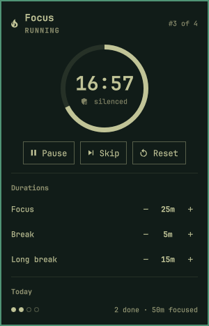
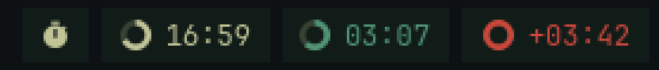
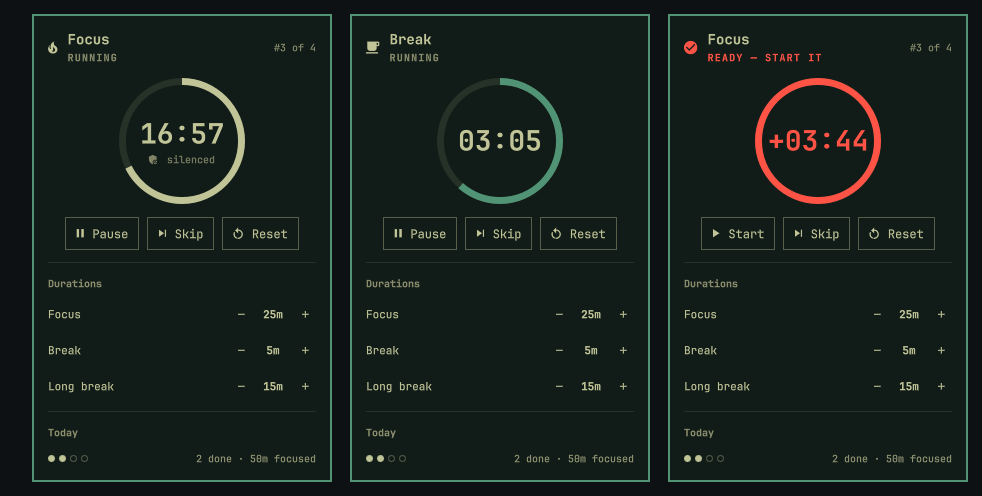

<h1 align="center">Pomodoro for Omarchy</h1>

<p align="center">
  A focus timer that lives in your bar — a ring that drains as the phase runs,
  a popup with the controls, and a couple of opinions about what a focus
  session should do to your desktop.
</p>

<p align="center">
  
</p>

<p align="center">
  
  
</p>

---

## Why another pomodoro timer

Most of them are a countdown with a beep. This one is wired into the desktop:
it silences your notifications while you're focusing, gives them back the
moment you stop, and refuses to let you quietly skip a break.

It also stays out of your way. When the timer isn't running you get a single
small glyph — not a clock sitting in your bar counting `25:00` at you all day.

<p align="center">
  
</p>

<p align="center">
  <em>idle &nbsp;·&nbsp; focus &nbsp;·&nbsp; break &nbsp;·&nbsp; overrun</em>
</p>

The ring drains clockwise as the phase runs and picks up the phase's color:
your foreground for focus, the theme accent for breaks, and the theme's urgent
color when a break has run over. Everything is drawn from the active Omarchy
theme, so it re-colors itself when you switch themes.

## Install

```bash
omarchy plugin add https://github.com/dansaiko/omarchy-pomodoro.git
omarchy plugin enable dansaiko.pomodoro right
```

Plugins land **disabled** so you can read the code before running it — Omarchy
plugins execute unsandboxed inside `omarchy-shell`, so that pause is there on
purpose. The `enable` line above places it in the bar's right section; swap
`right` for `left` or `center` to taste, or move it later:

```bash
omarchy bar move dansaiko.pomodoro --section center
```

To update or remove it:

```bash
omarchy plugin update dansaiko.pomodoro
omarchy plugin remove dansaiko.pomodoro
```

## Using it

**Bar widget**

| Input | Action |
|---|---|
| Left click | Open / close the panel |
| Right click | Start / pause |
| Middle click | Skip to the next phase |
| Scroll | ±1 minute on the current phase |

**Panel keyboard**

| Key | Action |
|---|---|
| `space` / `enter` | Start / pause |
| `s` | Skip phase |
| `r` | Reset phase |
| `j` `k` — or `↑` `↓` | Move between duration rows |
| `h` `l` — or `←` `→` | ±1 minute on the selected row |
| `esc` | Close the panel |

Hover the bar widget for a tooltip with the phase, time left, cycle position
and today's tally, without opening anything.

## How the phases work

Focus → break → focus → … with a long break every fourth pomodoro.

<p align="center">
  
</p>

Breaks **auto-start** the moment focus ends — if you have to press a button to
begin your break, you won't take it. Focus does **not** auto-start when a break
ends, because you shouldn't be on the clock while you're still away from the
desk.

Instead the widget starts nagging. It flips to your theme's urgent color,
pulses, and counts *upward* until you start the next pomodoro. That `+03:42`
is how long you've been meaning to get back to work.

Skipping is not completing: a skipped focus session is not logged and does not
advance the cycle toward a long break.

## What it does to your desktop

- **Do not disturb** switches on for the duration of a focus session and off
  again when it ends, when you pause, or when you reset. If DND was *already*
  on when focus started, the plugin leaves it alone and will never switch it
  off later — it only ever releases a DND it turned on itself.
- **A notification and a sound** on every phase change. The DND release is
  ordered to happen first, so the "focus complete" toast isn't the one thing
  DND swallows.
- **Every completed focus session is appended** to
  `~/.local/state/omarchy/pomodoro/sessions.jsonl`, one JSON object per line:

  ```json
  {"at":"2026-05-14T09:25:00.000Z","ts":1747214700000,"phase":"focus","minutes":25}
  ```

  Nothing reads it back except the "today" tally. It's there for you to graph.

## Configuration

The three durations are editable live from the panel — the `−` and `+` controls
write straight back to your config, so you can retune mid-day without opening a
file. Everything else lives inline on the widget's entry in
`~/.config/omarchy/shell.json`:

```json
{
  "bar": {
    "layout": {
      "right": [
        { "id": "dansaiko.pomodoro", "focusMinutes": 50, "breakMinutes": 10 }
      ]
    }
  }
}
```

| Key | Default | Meaning |
|---|---|---|
| `focusMinutes` | `25` | Focus length, 1–180 |
| `breakMinutes` | `5` | Short break length |
| `longBreakMinutes` | `15` | Long break length |
| `cycleLength` | `4` | Pomodoros between long breaks |
| `autoStartBreaks` | `true` | Roll straight into the break |
| `autoStartFocus` | `false` | Roll straight into the next focus |
| `silenceNotifications` | `true` | Enable DND while focusing |
| `sound` | `true` | Play a cue on phase change |
| `showIdleGlyph` | `true` | Show a glyph instead of a full clock when idle |
| `focusEndSound` | freedesktop `complete.oga` | Path to the focus-end sound |
| `breakEndSound` | freedesktop `alarm-clock-elapsed.oga` | Path to the break-end sound |

`shell.json` hot-reloads, so config changes apply without a restart.

## Scripting

The plugin registers an IPC target, so every action is available from the
shell:

```bash
omarchy-shell dansaiko.pomodoro start
omarchy-shell dansaiko.pomodoro pause
omarchy-shell dansaiko.pomodoro toggleTimer
omarchy-shell dansaiko.pomodoro skip
omarchy-shell dansaiko.pomodoro reset
omarchy-shell dansaiko.pomodoro status     # JSON
omarchy-shell dansaiko.pomodoro toggle     # the panel, not the timer
```

`status` is machine-readable, which makes it easy to pipe somewhere else:

```console
$ omarchy-shell dansaiko.pomodoro status
{"phase":"focus","running":true,"waiting":false,"remaining":"16:59",
 "remainingMs":1019214,"overrunMs":0,"cycle":"3/4","todayCount":2,"todayMinutes":50}
```

Bind the ones you use in `~/.config/hypr/bindings.lua`:

```lua
o.bind("SUPER SHIFT", "P", "Pomodoro",       "omarchy-shell dansaiko.pomodoro toggleTimer")
o.bind("SUPER CTRL",  "P", "Pomodoro panel", "omarchy-shell dansaiko.pomodoro toggle")
```

## Design notes

The timer is an **absolute deadline persisted to disk**, not a countdown held
in memory. `~/.local/state/omarchy/pomodoro/state.json` holds the phase, the
deadline, and the cycle position.

That one decision buys three things. The timer survives `omarchy restart shell`
mid-session and picks up exactly where it was. It cannot drift, because nothing
is accumulating rounding error tick by tick. And on a multi-monitor setup every
bar surface derives the same clock from the same deadline with no syncing at
all — phase transitions are fired by a single elected instance, so a second
monitor can't double-log a session or send the notification twice.

Runtime state lives entirely under `~/.local/state/omarchy/`, never in the
plugin folder, so updating or reinstalling the plugin never touches your
history.

## Requirements

- Omarchy with `omarchy-shell` (the Quickshell-based bar)
- A Nerd Font for the glyphs — Omarchy's default JetBrainsMono Nerd Font is fine
- `pw-play` (PipeWire) for the sound cues, optional; the timer works silently
  without it

## Uninstall

```bash
omarchy plugin remove dansaiko.pomodoro
rm -rf ~/.local/state/omarchy/pomodoro   # optional: also drop your session history
```

## License

[MIT](LICENSE) — do what you like with it.
